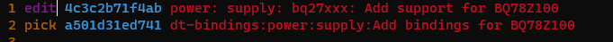

# 参考文档

http://www-cs-students.stanford.edu/~blynn/gitmagic/intl/zh_cn/

# Install

## windows

https://git-scm.com/download/win

https://desktop.github.com/

https://www.sourcetreeapp.com/

## ubuntu

```
sudo apt install git-all
```

### create a new repository

```
echo "# public_notes" >> README.md
git init
git add README.md
git commit -m "first commit"
git branch -M main
git remote add origin https://github.com/Qingwu-Li/public_notes.git
git push -u origin main
```

# clone a repository

```
git clone https://github.com/Qingwu-Li/linux-leica.git

# Clone a branch
 git clone -b leica/5.4-2.1.x-imx/crocodile  https://github.com/Qingwu-Li/linux-leica.git
 
 # Clone a branch to a floder
 git clone -b battery-bq78z100  https://github.com/Qingwu-Li/linux-leica.git kernel-source
```

# log/history

```
git log
git log --onelne
```

# checkout one commit

```undefined
git log --oneline
42af416d7146 (HEAD -> stable/linux-5.4.y, tag: v5.4.81, origin/stable/linux-5.4.y, origin/HEAD) Linux 5.4.81
cd7343987376 ASoC: Intel: Skylake: Automatic DMIC format configuration according to information from NHLT
6ebb6af62721 ASoC: Intel: Multiple I/O PCM format support for pipe
 
git checkout 6ebb6af62721
Note: checking out '6ebb6af62721'.

You are in 'detached HEAD' state. You can look around, make experimental
changes and commit them, and you can discard any commits you make in this
state without impacting any branches by performing another checkout.

If you want to create a new branch to retain commits you create, you may
do so (now or later) by using -b with the checkout command again. Example:

git checkout -b <new-branch-name>

HEAD is now at 6ebb6af62721 ASoC: Intel: Multiple I/O PCM format support for pipe
git log --oneline
6ebb6af62721 (HEAD) ASoC: Intel: Multiple I/O PCM format support for pipe
b2b05b04d44d ASoC: Intel: Skylake: Await purge request ack on CNL
a28144d62ddc ASoC: Intel: Allow for ROM init retry on CNL platforms
4029a29f93ef ASoC: Intel: Skylake: Shield against no-NHLT configurations
754df2d3349d ASoC: Intel: Skylake: Enable codec wakeup during chip init
```

# Check remote URL

```
git remote -v
origin  https://github.com/Qingwu-Li/linux-leica.git (fetch)
origin  https://github.com/Qingwu-Li/linux-leica.git (push)
```

# Add another remote and fetch


```
git remote add hexagon https://github.com/hexagon-geo-surv/linux-leica.git
git remote -v
hexagon https://github.com/hexagon-geo-surv/linux-leica.git (fetch)
hexagon https://github.com/hexagon-geo-surv/linux-leica.git (push)
origin  https://github.com/Qingwu-Li/linux-leica.git (fetch)
origin  https://github.com/Qingwu-Li/linux-leica.git (push)
git fetch hexagon
.....
 git branch -a
* (HEAD detached at 6ebb6af62721)
  stable/linux-5.4.y
  remotes/hexagon/leica/5.4-2.1.x-imx/crocodile
  remotes/hexagon/leica/5.4-2.1.x-imx/dragonstaff
  remotes/hexagon/leica/5.4-2.2.x-imx/crocodile
  remotes/hexagon/leica/5.4-2.2.x-imx/dragonstaff
  remotes/hexagon/linux-4.4.y-colibri
.....
  remotes/origin/linux-fslc/5.4-2.2.x-imx
  remotes/origin/magnetometer
  remotes/origin/magnetometer-cherry-pick
  remotes/origin/master
  remotes/origin/power_supply_master
  remotes/origin/stable-rt/v4.4-rt
  remotes/origin/stable/linux-4.4.y
  remotes/origin/stable/linux-5.4.y
  remotes/origin/variscite/lf-5.4.y_var01/5.4-2.1.x-imx
```


# Create/Show/checkout branches 

```
 git branch hello_new_branch
git branch -a
* (HEAD detached at 6ebb6af62721)
  hello_new_branch
  stable/linux-5.4.y
  remotes/hexagon/leica/5.4-2.1.x-imx/crocodile
  remotes/hexagon/leica/5.4-2.1.x-imx/dragonstaff
  remotes/hexagon/leica/5.4-2.2.x-imx/crocodile
  remotes/hexagon/leica/5.4-2.2.x-imx/dragonstaff
 ....
  remotes/origin/linux-fslc/5.4-2.2.x-imx
  remotes/origin/magnetometer
  remotes/origin/magnetometer-cherry-pick
  remotes/origin/master
  remotes/origin/power_supply_master
  remotes/origin/stable-rt/v4.4-rt
  remotes/origin/stable/linux-4.4.y
  remotes/origin/stable/linux-5.4.y
  remotes/origin/variscite/lf-5.4.y_var01/5.4-2.1.x-imx
git checkout hello_new_branch
Switched to branch 'hello_new_branch'
```

#   Discarding local changes(Do not try)

```git ssh
git clean -fd
```


# add/commit/push to a branch


```
git branch -a
git diff
git status
git add recipes-leica/show-buildinfo/files/show-build 
git status
git commit --signoff

git remote -v
git branch -a
git branch fix-show-build-date
git log 
git remote -v
git push --set-upstream origin fix-show-build-date
git push --set-upstream origin battery-bq78z100
```


# amend

```
git status
git add recipes-leica/show-buildinfo/files/show-build 
git status
git commit --signoff --amend
git branch -a
git push --force
```
# Rebase

```
git rebase -i HEAD~2
```


# commit 之后发现 主分支已经被修改

```
  
  
 git branch -a
    dunfell
    dunfell-202008
  * embtests_uart
    remotes/leica-geo-surv/dunfell
    remotes/leica-geo-surv/dunfell-202008
    remotes/leica-geo-surv/embtests_uart
    remotes/leica-geo-surv/kernel_official
    remotes/leica-geo-surv/master
    remotes/m/dev/geosurv -> leica-geo-surv/dunfell
git rebase dunfell
  CONFLICT (add/add): Merge conflict in recipes-support/libgpiod/libgpiod_%.bbappend
  Auto-merging recipes-support/libgpiod/libgpiod_%.bbappend
  Auto-merging recipes-core/packagegroup/packagegroup-geosurv-dev.bb
  error: could not apply 3d7c941... add pyserial and embtests into dev image
  Resolve all conflicts manually, mark them as resolved with
  "git add/rm <conflicted_files>", then run "git rebase --continue".
  You can instead skip this commit: run "git rebase --skip".
  To abort and get back to the state before "git rebase", run "git rebase --abort".
  Recorded preimage for 'recipes-support/libgpiod/libgpiod_%.bbappend'
  Could not apply 3d7c941... add pyserial and embtests into dev image
```

  

# github fork project, 与上游同步

```
git remote -v
origin  https://github.com/qing-wu-li/linux-leica.git (fetch)
origin  https://github.com/qing-wu-li/linux-leica.git (push)

git remote add upstream https://github.com/hexagon-geo-surv/linux-leica.git
git remote -v
origin  https://github.com/qing-wu-li/linux-leica.git (fetch)
origin  https://github.com/qing-wu-li/linux-leica.git (push)
upstream        https://github.com/hexagon-geo-surv/linux-leica.git (fetch)
upstream        https://github.com/hexagon-geo-surv/linux-leica.git (push)


```

```
git reset --hard HEAD^      //恢复到上个版本。
git reset --hard e475a
git show
```


# 修改remote 地址

```
git remote -v
origin  https://github.com/hexagon-geo-surv/linux-leica (fetch)
origin  https://github.com/hexagon-geo-surv/linux-leica (push)
git remote set-url origin https://github.com/qing-wu-li/linux-leica.git

git remote set-url origin https://github.com/Qingwu-Li/linux-leica.git

git remote set-url origin https://github.com/Qingwu-Li/linux-leica.git

git remote -v
origin  https://github.com/qing-wu-li/linux-leica.git (fetch)
origin  https://github.com/qing-wu-li/linux-leica.git (push)

https://github.com/Qingwu-Li/linux-leica.git

```

# github fork出来的仓库同步upstream

```
git remote add upstream https://github.com/hexagon-geo-surv/linux-leica.git
git fetch upstream

git rebase upstream/leica/5.4-2.1.x-imx/crocodile
git push
```

# tag

```
git tag -l
>git tag -l v5.9.*
v5.9.1
v5.9.10
v5.9.11
v5.9.12
v5.9.13
v5.9.2
v5.9.3
v5.9.4
v5.9.5
v5.9.6
v5.9.7
v5.9.8
v5.9.9
>git show v5.9.12
tag v5.9.12
Tagger: Greg Kroah-Hartman <gregkh@linuxfoundation.org>
Date:   Wed Dec 2 08:54:35 2020 +0100
......
commit 89bb11da843beec4a6004ef7ecfa44b83a68b56c (tag: v5.9.12)

commit 5dbeb9f76cef6e1b3ba9e8dbf1a3fa276ae0f5d2 (tag: v5.9.10)

git reset --hard 89bb11da843beec4a6004ef7ecfa44b83a68b56c

```

## reorder commits

```
git log --oneline
927a1c854964 (HEAD -> battery-bq78z100, origin/battery-bq78z100) power: supply: bq27xxx: Add support for BQ78Z100
6b01adb0088d power: supply: bq27xxx_battery: Add the BQ28z610 Battery monitor
467987e57105 power: supply: bq27xxx_battery: Add the BQ27Z561 Battery monitor
7ef6de8d972a arm64: crocodile_defconfig: modified for bq78z100 I2C battery fuel guage. Set CONFIG_BATTERY_BQ27XXX_I2C for Crocodile battery Clear CONFIG_BATTERY_SBS
917f86610011 arm64: dts: crocodile: Add battery driver of bq78z100 into node i2c3
99ee64679355 (origin/leica/5.4-2.1.x-imx/crocodile, leica/5.4-2.1.x-imx/crocodile) Merge fslc/5.4-2.1.x-imx into leica/5.4-2.1.x-imx/crocodile

git rebase -i HEAD~3
  1 pick 917f86610011 arm64: dts: crocodile: Add battery driver of bq78z100 into node i2c3
  2 pick 7ef6de8d972a arm64: crocodile_defconfig: modified for bq78z100 I2C battery fuel guage. Set CONFIG_BATTERY_BQ27XXX_I2C for Crocodile battery Clear CONFIG_BATTERY_SBS
  3 pick 467987e57105 power: supply: bq27xxx_battery: Add the BQ27Z561 Battery monitor
  4 pick 6b01adb0088d power: supply: bq27xxx_battery: Add the BQ28z610 Battery monitor
  5 pick 927a1c854964 power: supply: bq27xxx: Add support for BQ78Z100
  
  

```

# 修改中间提交

## 修改最后一个

```
git commit --amend
```

## 修改某次提交,例如倒数第二个

```
git rebase -i HEAD~2
```
edit 要修改的commit,

pick 要保留的commit


```
修改
vim drivers/power/supply/bq27xxx_battery.c
添加
git add drivers/power/supply/bq27xxx_battery.c
提交
git commit --signoff --amend
git rebase --continue
git push --force
```

